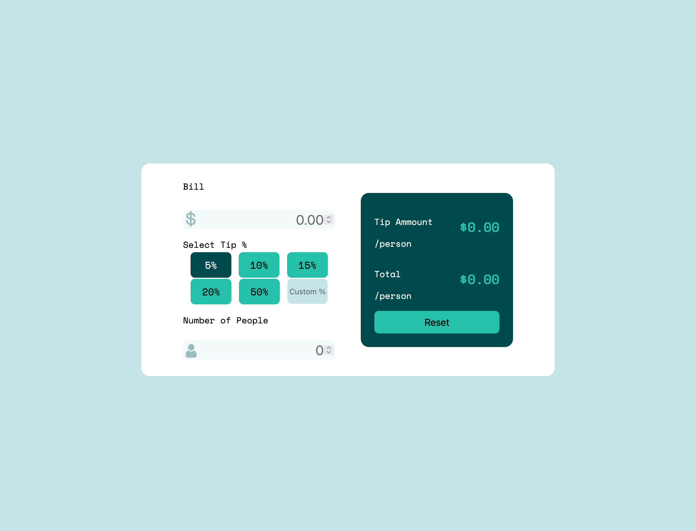

# Frontend Mentor - Tip calculator app solution

This is a solution to the [Tip calculator app challenge on Frontend Mentor](https://www.frontendmentor.io/challenges/tip-calculator-app-ugJNGbJUX). Frontend Mentor challenges help you improve your coding skills by building realistic projects.

### The challenge

Users should be able to:

- View the optimal layout for the app depending on their device's screen size
- See hover states for all interactive elements on the page
- Calculate the correct tip and total cost of the bill per person

### Screenshot



### Links

- Live Site URL: [Here](https://determined-pike-b95fcb.netlify.app/)

### Built with

- HTML5
- Flexbox
- Mobile-first workflow
- Vanilla Javascript

### What I learned

In this project I learned more about using objects to store data and use that data in other places in the application. Also I used input events to calculate and update information as the user interacts with the application.

To practice with objects I stored all of my HTML elements in objects as well.

At first I had used a text input type because I did not want the arrow inputs that show on the number input. I was able to find a way to change how the number input is displayed from Stack Overflow, by using css to change the appearance on the inner and outer "spin-button".

The CSS for hiding the arrows on the number input.

```css
input[type="number"] {
  border-style: none;
  background-color: hsl(189, 41%, 97%);
  padding: 3px;
  border-radius: 8px;
  margin-top: 0;
}

input[type="number"]::-webkit-outer-spin-button,
input[type="number"]::-webkit-inner-spin-button {
  -webkit-appearance: none;
  -moz-appearance: none;
  appearance: none;
  margin: 0;
}
```

Getting better with functions. My renderData() function called on each input event - calculates the data and updates HTML.

```js
function renderData() {
  const calculatedData = calculateTip();
  if (calculatedData.bill && calculatedData.people) {
    htmlElements.tipTotal.innerText = `$${calculatedData.splitTip}`;
    htmlElements.fullTotal.innerText = `$${calculatedData.splitBill}`;
  } else {
    htmlElements.tipTotal.innerText = `$0.00`;
    htmlElements.fullTotal.innerText = `$0.00`;
  }
}
```

Getting the custom input to work was one of the biggest challenges in the project.

```js
inputs.custom.addEventListener("click", () => {
  // Uncheck any radio inputs
  if (document.querySelector("input[type=radio]:checked").checked) {
    document.querySelector("input[type=radio]:checked").checked = false;
  }

  renderData();
  inputs.custom.addEventListener("input", () => {
    renderData();
  });
});
// From inside calculateTip() that is called in renderData()
if (customInput) {
  percent = customInput;
}
// From inside calculateTip() that is called in renderData()
```
